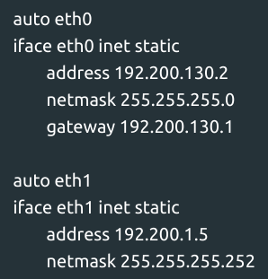

# Jarkom Modul 4 F02 2022

### Anggota:

1. [Andymas Narendra Bagaskara](https://github.com/zaibir123) (05111940000192)
2. [Jayanti Totti Andhina](https://github.com/JayantiTA) (5025201037)
3. [Gaudhiwaa Hendrasto](https://github.com/gaudhiwaa) (5025201066)

### 1. CIDR

#### Penentuan Class Subnetting

Class A:


Class B:


Class C:


Class D:


Class E:


Class F:


Class G:


Class H:


#### CIDR Tree:


#### Topologi pada GNS3:


#### Setup Network Interfaces

The Resonance:


The Order:


The Minister:


The Dauntless:


The Magical:


The Instrument:


The Profound:


The Firefist:


The Queen:



Ashaf (50 Host):


Guideau (1000 Host):


Phanora (150 Host):


Johan (100 Host):


Corvekt (200 Host):


Haines (70 Host):


Matt Cugatt (120 Host):


Spendrow (120 Host):


Helga (70 Host):


Keith (210 Host):


Oakleave (500 Host):


The Beast:


The Witch:


a.  Uncomment ```net.ipv4.ip_forward=1 pada file /etc/sysctl.conf``` pada semua router.

b.  Pada router The Resonance masukkan command ```iptables -t nat -A POSTROUTING -o eth0 -j MASQUERADE -s 192.200.0.0/16```

c.  Masukkan routing ke dalam router.bash setiap router, kemudian
     jalankan ```bash router.bash```

The Resonance:


The Order:


The Minister:


The Instrument:


The Firefist:


### 2. VLSM


| Subnet | Node           | IP             | Subnet Mask     | Length |
|--------|----------------|----------------|-----------------|--------|
| A1     | The Minister   | 192.200.0.1    | 255.255.252.0   | /22    |
| A1     | Guideau        | 192.200.0.2    | 255.255.252.0   |        |
| A2     | The Dauntless  | 192.200.8.1    | 255.255.255.0   | /24    |
| A2     | Phanora        | 192.200.8.2    | 255.255.255.0   |        |
| A2     | Johan          | 192.200.8.3    | 255.255.255.0   |        |
| A3     | The Order      | 192.200.11.193 | 255.255.255.252 | /30    |
| A3     | The Minister   | 192.200.11.194 | 255.255.255.252 |        |
| A4     | The Order      | 192.200.11.129 | 255.255.255.192 | /26    |
| A4     | Ashaf          | 192.200.11.130 | 255.255.255.192 |        |
| A5     | The Resonance  | 192.200.11.197 | 255.255.255.252 | /30    |
| A5     | The Order      | 192.200.11.198 | 255.255.255.252 |        |
| A6     | The Resonance  | 192.200.11.201 | 255.255.255.252 | /30    |
| A6     | The Instrument | 192.200.11.202 | 255.255.255.252 |        |
| A7     | The Resonance  | 192.200.11.205 | 255.255.255.252 | /30    |
| A7     | The Magical    | 192.200.11.206 | 255.255.255.252 |        |
| A8     | The Resonance  | 192.200.11.209 | 255.255.255.252 | /30    |
| A8     | The Beast      | 192.200.11.210 | 255.255.255.252 |        |
| A9     | The Magical    | 192.200.6.1    | 255.255.254.0   | /23    |
| A9     | Corvekt        | 192.200.6.2    | 255.255.254.0   |        |
| A9     | Haines         | 192.200.6.3    | 255.255.254.0   |        |
| A10    | The Instrument | 192.200.10.1   | 255.255.255.128 | /25    |
| A10    | Matt Cugat     | 192.200.10.2   | 255.255.255.128 |        |
| A11    | The Instrument | 192.200.11.213 | 255.255.255.252 | /30    |
| A11    | The Firefist   | 192.200.11.214 | 255.255.255.252 |        |
| A12    | The Instrument | 192.200.11.217 | 255.255.255.252 | /30    |
| A12    | The Profound   | 192.200.11.218 | 255.255.255.252 |        |
| A13    | The Profound   | 192.200.11.1   | 255.255.255.128 | /25    |
| A13    | Heiga          | 192.200.11.2   | 255.255.255.128 |        |
| A14    | The Profound   | 192.200.10.129 | 255.255.255.128 | /25    |
| A14    | The Spendrow   | 192.200.10.130 | 255.255.255.128 |        |
| A15    | The Firefist   | 192.200.9.1    | 255.255.255.0   | /24    |
| A15    | Keith          | 192.200.9.2    | 255.255.255.0   |        |
| A15    | The Queen      | 192.200.9.3    | 255.255.255.0   |        |
| A16    | The Firefist   | 192.200.4.1    | 255.255.254.0   | /23    |
| A16    | Oakleave       | 192.200.4.2    | 255.255.254.0   |        |
| A17    | The Queen      | 192.200.11.221 | 255.255.255.252 | /30    |
| A17    | The Witch      | 192.200.11.222 | 255.255.255.252 |        |
| A18    | The Minister   | 192.200.11.225 | 255.255.255.252 | /30    |
| A18    | The Dauntless  | 192.200.11.226 | 255.255.255.252 |        |

Host : 2617

Subnet : /20

Routing

The Dauntless


The Minister


The Order


The Resonance


The Magical


The Instrument


The Profound


The Firefist


The Queen


